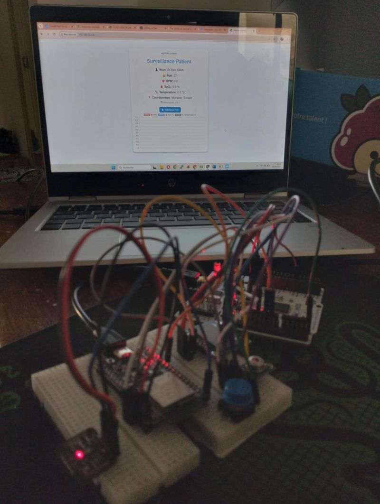

# IoT Biomedical Monitoring System 🩺

An embedded IoT system to monitor **Heart Rate (BPM)**, **SpO₂**, and **Body Temperature** in real time.

## 🚀 Features
- MAX30102 sensor for Heart Rate & SpO₂
- MLX90614 infrared sensor for Temperature
- OLED display for instant feedback
- STM32F446RE for data acquisition & processing
- ESP32 for UART communication & Wi-Fi transmission
- Real-time web dashboard for remote monitoring

## 🛠️ Tech Stack
- **Embedded C** (STM32 & ESP32)
- **UART Protocol** for STM32–ESP32 communication
- **ESP-IDF / Arduino IDE**
- **Web Dashboard** (HTML, CSS, JS, or other stack you used)

## 📸 Demo
[

## 📂 Project Structure
